# The Wild Oasis – Internal Cabin Booking System

[Link to live project](https://the-wild-oasis-isaac.netlify.app/login)

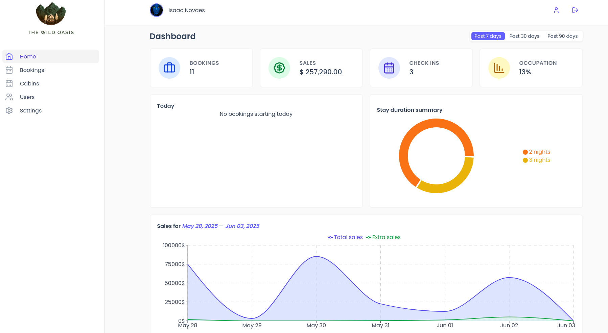

## Overview

A full-stack web application for managing cabin bookings in a small business environment. Built with React, TanStack Router, TanStack Query, Tailwind CSS, CSS container queries, and Supabase, the system supports full CRUD operations for cabins, users, and bookings. Key features include dynamic pricing configuration, check-in/check-out flows, responsive UI with container queries, type-safe routing, URL-based filtering/sorting, and PDF booking exports. Designed as an internal tool, it emphasizes usability, data integrity, and modern frontend/backend integration.

## How to run this project

- clone project from github
- on terminal at project root, run `npm install`
- on terminal at project root, run `npm run dev`

## Features

### Settings

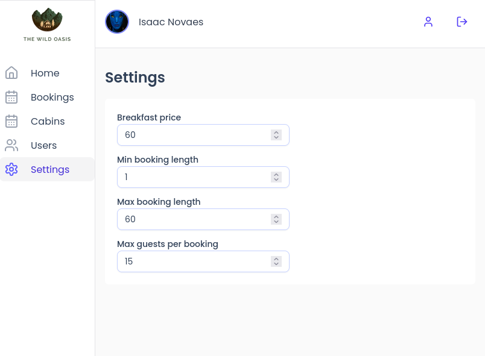

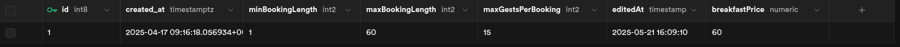

- id
- created_at
- minBookingLength
- maxBookingLength
- maxGuestsPerBooking
- editedAt
- breakfastPrice

On settings page, it's possible to define application global config that validates and defines booking prices when creating or editing a booking

### Users

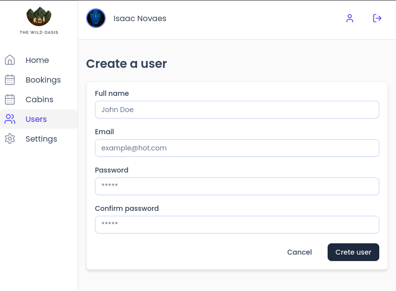

Since the wild oasis application is built for internal usage, only employees can create a new user. Each user is an employee.

### Cabins

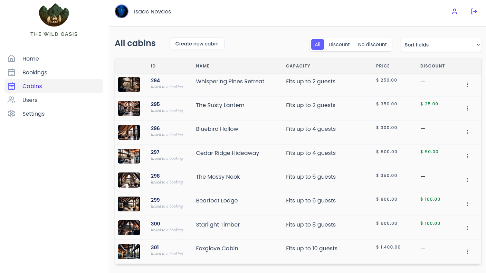

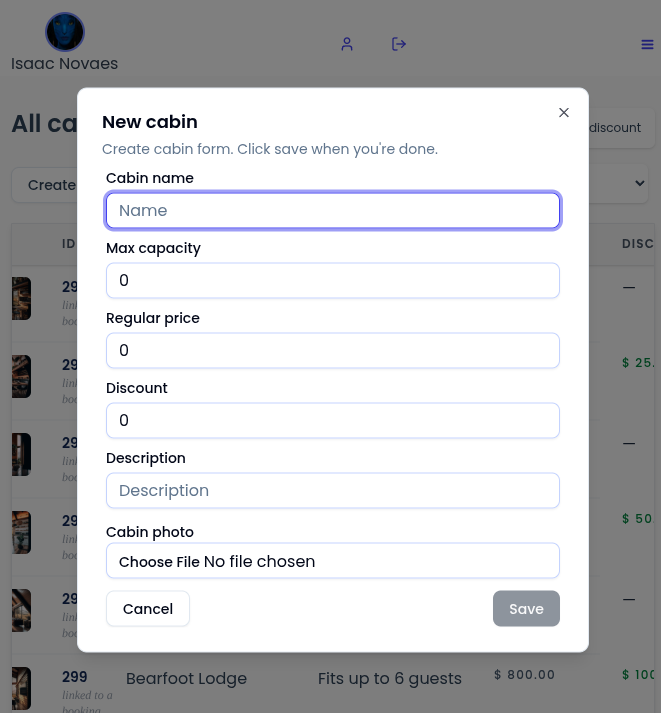

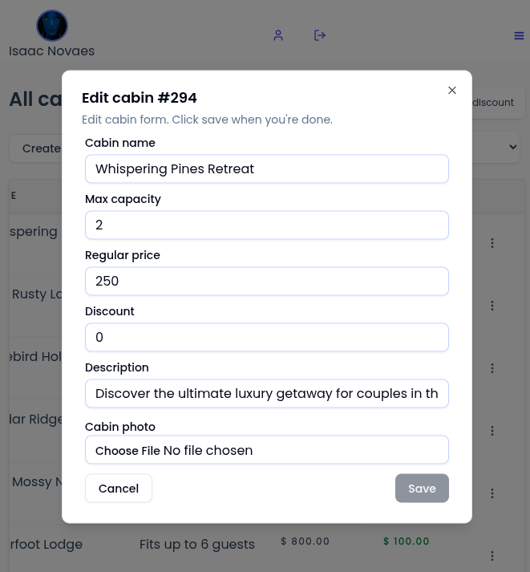

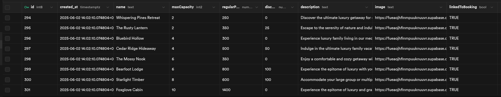

- id (primary key)
- created_at
- name
- maxCapacity
- regularPrice
- discount
- description
- image
- linkedToBooking

For cabins, it's possible to perform all regular operations (create, edit, and delete). Additionally, cabins can also be duplicated

Cabins linked to a booking cannot be deleted. This information is represented by "linkedToBooking"

The cabin image field stores the image public url, stored on supabase bucket "images"

On cabins table, filters and sorts are available

Filters and sorts are stored on url for easy sharing and bookmarking

### Guests

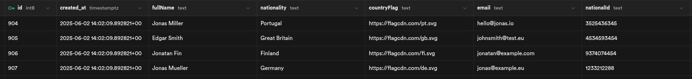

- id (primary key)
- created_at
- fullName
- nationality
- countryFlag
- email
- nationalId

Guests can be chosen while creating a booking

### Bookings

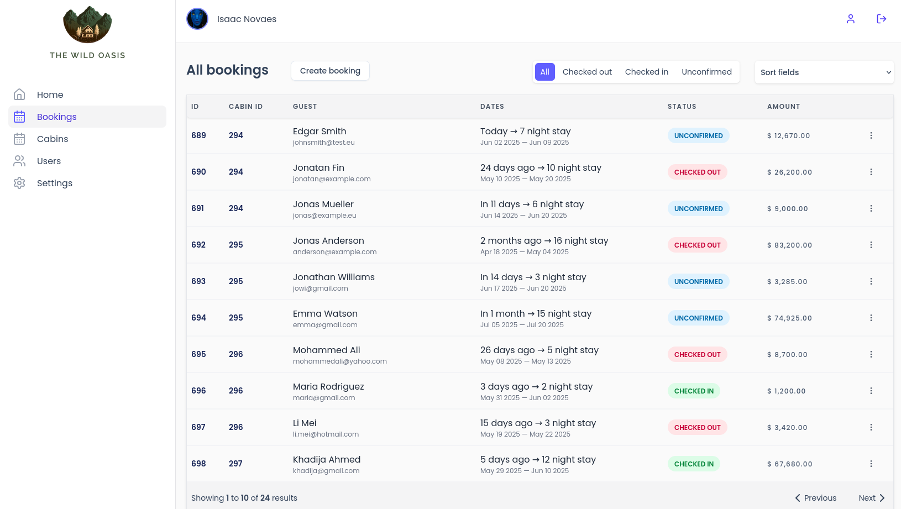

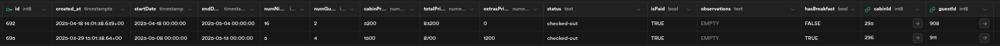

- id
- created_at
- startDate
- endDate
- numNights
- numGuests
- cabinPrice
- totalPrice
- extrasPrice
- status enum(unconfirmed, checked-in, checked-out)
- isPaid
- observations
- hasBreakfast
- cabinId (Foreign key relation: cabinId → cabins.id)
- guestId (Foreign key relation: guestId → guests.id)

#### Bookings page

On bookings page, the bookings are displayed.

Filters and sorts are available and stored on url for easy sharing and bookmarking

Unconfirmed bookings can be edited and checked in.

#### Booking check in

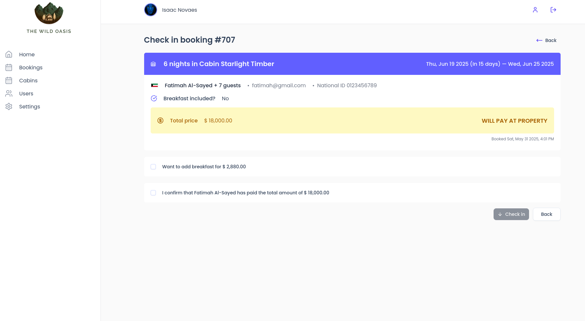

On check in, payment has to be confirmed.

Also, it's possible to add or remove breakfast for the guests

#### Booking detail

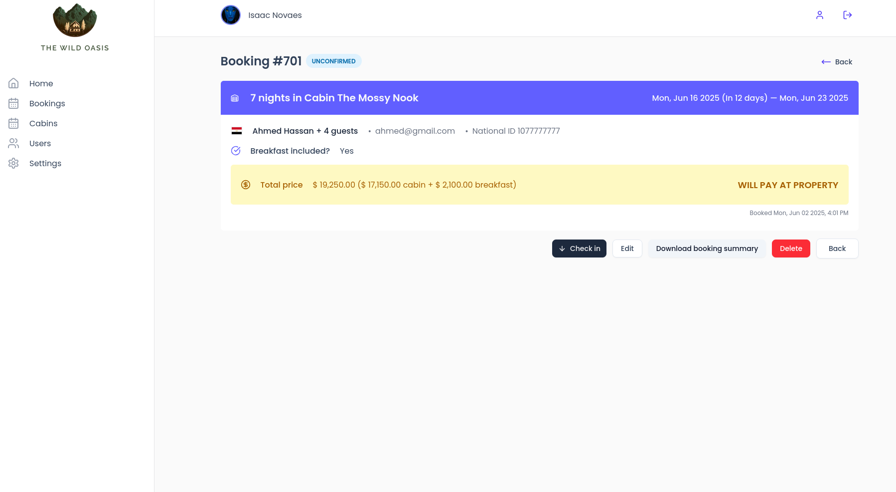

On booking detail page, all booking information is displayed.

A pdf with the booking information can be downloaded.

## What I learned

In this project, I decided to practice different technologies that I've been wanting to investigate.

Since React didn't have a type-safe router and since I very much appreciate such a feature, TanStack Router was the way to go. File base routing is not something new in the React ecosystem, but the type-safe won me. From now on, I will keep using it for my side projects.

It was also the first time I used tailwindcss and tanstack query in a side project. I will also keep using it. Tanstack query makes interacting with server state a breeze (no need to write any useEffect or intermediate useState's for request states). Tailwind css also facilitates working with css, specially because there is no css duplication, no problem with naming classes, no clash with classes that have the same name. Simple syntax, huge advantage.

Apart from that, it was the very first time I worked with container queries in css. It was very important to easily make the table components responsive. Without container queries, this project would not be fully responsive, because from 1215px to 1280px, even though the display port is always growing, every single route component reduces its size at 1280px - the side bar grows at this viewport width. So defining the display of the table components solely on the viewport width here would break the design.
